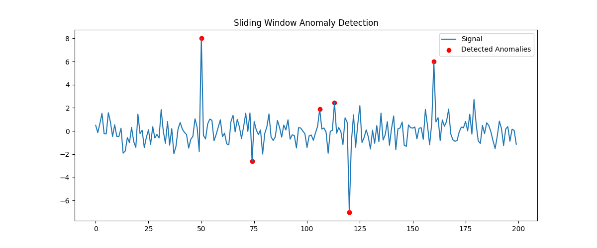

# Anomaly Detection in Time-Series Data

## 📌 Project Overview

This project implements a statistical anomaly detection system using Python. It analyzes time-series data and identifies abnormal patterns based on deviations from local statistical behavior.

The system uses a sliding window approach to dynamically compute mean and standard deviation, allowing detection in non-stationary environments such as cyber-physical systems and sensor networks.

---

## ⚙️ Methodology

* Synthetic time-series data generation
* Injection of artificial anomalies
* Sliding window analysis
* Z-score based anomaly detection
* Visualization of detected anomalies

---

## 🧠 Key Concept

For each data point, the system computes a local z-score:

z = (x - μ) / σ

If |z| > threshold (typically 3), the point is classified as an anomaly.

---

## 📊 Output

The system generates a visualization highlighting detected anomalies:



---

## 🛠️ Technologies Used

* Python
* NumPy
* Matplotlib

---

## ▶️ How to Run

1. Install dependencies:

```
pip install -r requirements.txt
```

2. Run the script:

```
python main.py
```

---

## 🎯 Applications

* Cyber-Physical Systems (CPS) monitoring
* Robotics sensor validation
* Industrial anomaly detection
* IoT system analysis

---

## 🚀 Future Improvements

* Integration with real-world datasets
* Machine learning-based anomaly detection
* Real-time streaming analysis
* Edge deployment on embedded systems

---
